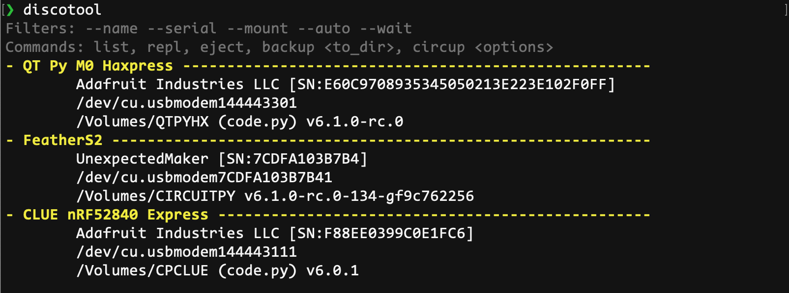
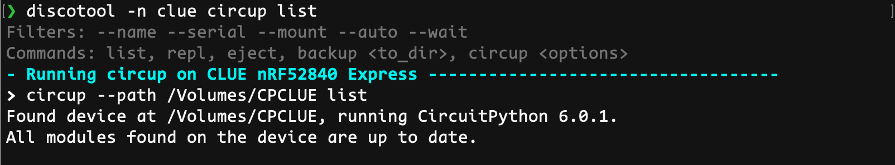

USB Infos / Disco Tool

Module and tool to discover all boards connected to USB.
Usbinfo module: exposes the getDeviceList() function. Find boards on the host's USB bus and tries to match them with serial ports and mounted drives, virtual or not. When a drive is found, it lists circuitpython information if available: CPY version number and main files (code.py, etc.). Returns the list of boards found with their information, and a list of unmatched serial ports.
``` python
[{
	'manufacturer': 'Adafruit Industries LLC',
	'name': 'CLUE nRF52840 Express',
	'ports': ['/dev/cu.usbmodem144443111'],
	'product_id': 32882,-
	'serial_num': 'F88EE0399C0E1FC6',
	'vendor_id': 9114,
	'version': '6.0.1',
	'volumes': [{'mains': ['code.py'], 'mount_point': '/Volumes/CPCLUE'}]
}]
```

### Tool use

- --wait: runs the scan every second until it detects a board.
- --nocolor: do not output colors in the terminal.

#### Filters

Filters select boards from the list of devices found to run a command on them. They are combined with OR logic: anything that matches any filter is selected. All filters are NOT case sensitive. Filters are simple text matches, they don't support wildcards.

- **`--auto`**: select the first board found. For when a single board is connected.
- **`--name`**: search in the USB name/description field. Eg: "clue", "QT", "S2".
- **`--serial`**: search the serial number of the board.
- **`--mount`**: search the volume names of the board. Eg: "CIRCUITPY".

#### No Command

- if no filter is given, run the `list` command
- if filters are given, run the `repl` command

#### Commands

-	**`list`** lists all the boards that have been detected, with name, manufacturer, serial number. Lists the serial ports and file volumes, identifying circuitpython code files present, as well as CPY version.
-	**`repl`** connect to the REPL of the selected boards using the tool specified, screen by default, choosing the first serial port found if there is more than one.
-	**`eject`** eject all selected board drives, or all found if no filter given. (macOS only for now)
-	**`backup <destination dir> [<sub dir>]`** copy the content of the selected boards drives into the destination dir or the optional sub dir (that will be created for you). Each board is put in a directory with it's name and serial number.
-	**`--create`** create the destination dir if it does not exist.
-	**`circup <options>`** calls circup with its `--path` option to each selected board and passes all other options and commands to it.

#### Examples:

discotool


discotool -n clue


discotool -n clue circup update


[Samples of what output you can expect from some boards.](docs/examples.md)
