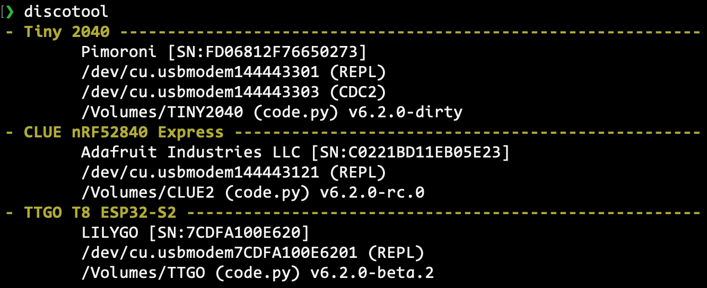
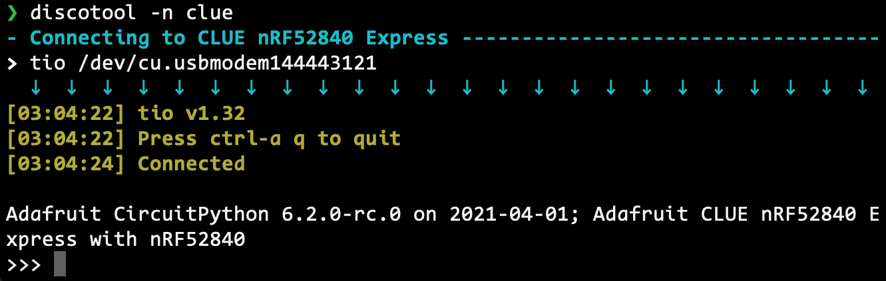
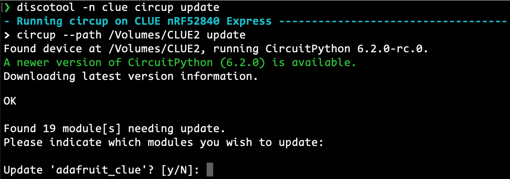

## DiscoTool
Module and tool to discover all boards connected to USB.

### Module
Exposes the `get_devices_list()` function. Find boards on the host's USB bus and tries to match them with serial ports and mounted drives, virtual or not. When a drive is found, it lists circuitpython information if available: CPY version number and main files in order of priority (code.py, etc.). Returns the list of boards found with their information, and a list of unmatched serial ports.
```python
import discotool
deviceList, remainingPorts = discotool.get_devices_list()
```
Device list:
```python
[{
	'manufacturer': 'Adafruit Industries LLC',
	'name': 'CLUE nRF52840 Express',
	'ports': [{
		"dev": "'/dev/cu.usbmodem144443111'",
		"iface": "CircuitPython CDC data"
	}],
	'product_id': 32882,
	'serial_num': 'F88EE0399C0E1FC6',
	'vendor_id': 9114,
	'version': '6.0.1',
	'volumes': [{
		'mount_point': '/Volumes/CIRCUITPY'
		'mains': ['code.py'],
	}]
}]
```

## Operating system
It currently runs on MacOS, Linux and Windows. The `requirements.txt` and `requirements-*.txt` files list the requirements per platform.

## discotool CLI tool

### Install and use

The `discotool` command line program can be installed with pip. You can also import the module directly `python3 import -m /path/to/discotool`.
```
python3 -m pip install discotool-for-microcontrollers
```

When using a single board, it will be automatically selected for commands, these are the commands I use the most:
- **`discotool repl`** to connect to the REPL.
- **`discotool install ...`** to install modules via circup.
- **`discotool update`** to update modules via circup.

### Configuration

Define environment variables to override the default command line tools used by discotool. They are called by appending the relevant parameters at the end.
- **`DISCOTOOL_SERIALTOOL`** (`screen`/`PuTTY`) command to connect to the REPL (tio, picocom, etc.)
- **`DISCOTOOL_CIRCUP`** (`circup`) command to call circup (`pip install` it for the default)
- **`DISCOTOOL_NOCOLOR`** disables colors in the output if it evaluates to True

### Command line options

- **`--wait`**: runs the scan every second until it detects a board.
- **`--nocolor`**: do not output colors in the terminal (overrides all else).
- **`--color`**: output colors in the terminal (overrides all else).

#### No Command

- if no filter is given, run the `list` command
- if filters are given, run the `repl` command

#### Filters
Filters select boards from the list of devices found to run a command on them. They are combined with OR logic: anything that matches any filter is selected. All filters are NOT case sensitive. Filters are simple text matches, they don't support wildcards.

- **`--auto`**: select the first board found.
- **`--name`**: search in the USB name/description field. Eg: "clue", "QT", "S2".
- **`--serial`**: search the serial number of the board.
- **`--mount`**: search the volume names of the board. Eg: "CIRCUITPY".

#### Commands

-	**`list`** lists all the boards that have been detected, with name, manufacturer, serial number. Lists the serial ports and file volumes, identifying circuitpython code files present, as well as CPY version.
-	**`repl`** connect to the REPL of the selected boards using the tool specified, screen by default, choosing the first serial port found if there is more than one.
-	**`eject`** eject all selected board drives, or all found if no filter given. (MacOS only for now)
-	**`backup <destination dir> [<sub dir>]`** copy the content of the selected boards drives into the destination dir or the optional sub dir (that will be created for you). Each board is put in a directory with its name and serial number.
	-	**`--create`** create the destination dir if it does not exist.
	-	**`--date`** use a time stamp as subdirectory name, or add to the supplied name.
-	**`circup <options>`** calls circup with its `--path` option to each selected board and passes all other options and commands to it.
-	**`get <key>`** print just the value for the key, for the selected devices. Can be used with backticks and such in a shell script. Includes special keys:
	- **`pid`**, **`vid`**, **`sn`**: shortcuts for product_id, vendor_id and serial_num.
	- **`volume`**: path to the (first) mounted drive of the device.
	- **`port`**: (first) serial port of the device.
	- **`repl`**: (first) REPL serial port of the device.
	- **`cdc`**: (first) non-REPL serial port of the device.
	- **`main`** or **`code.py`**: full path to the main file for circuitpython.
-	**`json`** print the output of usbinfo as json for all selected boards.
	- **`--pretty`**: pretty print it for human reading.

## Screenshots:

`discotool`


`DISCOTOOL_SERIALTOOL=tio discotool -n clue`


`discotool -n clue circup update`


[Samples of what output you can expect from some boards.](docs/examples.md)
